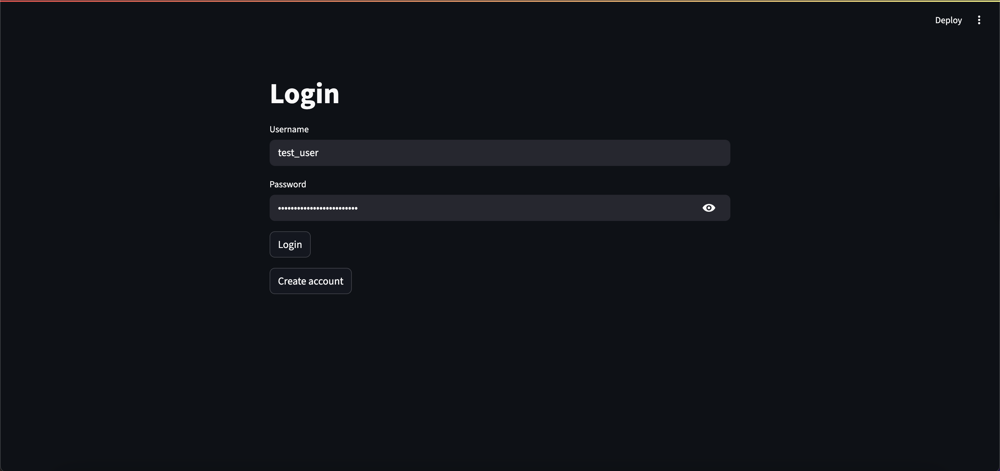
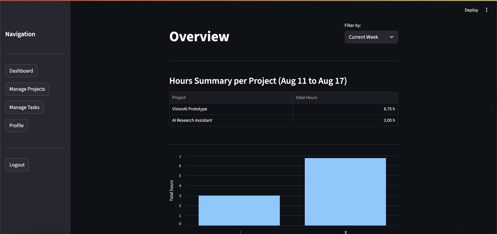
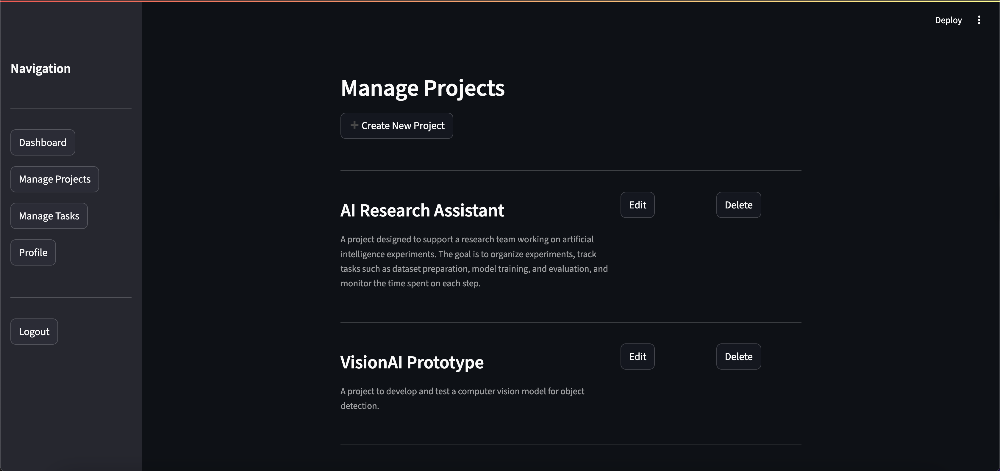
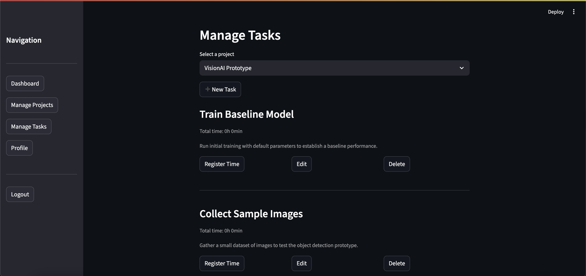
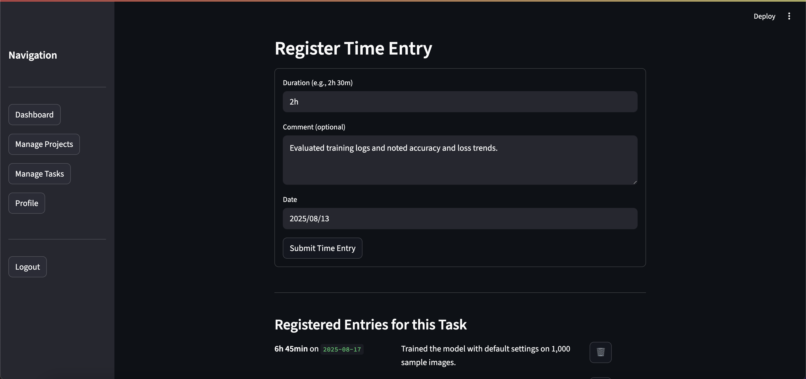

# ⏱️ Track Time App

**Track Time App** is a simple web application that allows users to **create projects**, add **tasks**, and log **time entries** for each task.  

It’s designed to be lightweight but practical — ideal for anyone who needs to register task times regularly in their daily workflow.  

---

## 🛠 Tech Stack
- **Backend:** Django REST Framework (`djangoprj/`)
- **Frontend:** Streamlit (`frontend/`)
- **Database:** SQLite3 (default engine)
- **Authentication:** Token-based register & login system – each user has **isolated data**
- **Package Management:** Recommended to use [uv](https://github.com/astral-sh/uv) (instead of pip)

---

## 🚀 Features
- ✅ User authentication (register & login)  
- ✅ Project creation and management  
- ✅ Task management within projects  
- ✅ Time entry registration per task (hours + comments)  
- ✅ Dashboard with filters: *Current Week, Last Week, Current Month, Last Month, All Time*  
- ✅ Export project summaries to Excel  

---

## 📸 Screenshots

| Login Page | Overview (Dashboard) |
|------------|-----------------------|
|  |  |

| Manage Projects | Manage Tasks |
|-----------------|---------------|
|  |  |

| Log Time Entries |
|------------------|
|  |

## ⚡ Installation

This project uses **[uv](https://github.com/astral-sh/uv)**, a super fast Python package manager.  
It’s recommended over `pip` for faster installs and better dependency management.  

### 1. Clone the repository
```bash
git clone https://github.com/your-username/track_time_app.git
cd track_time_app
